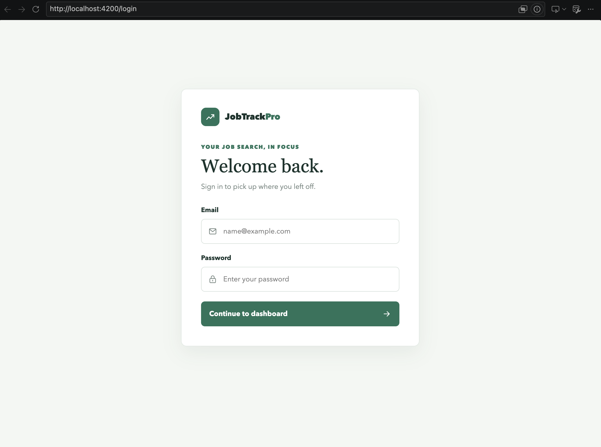
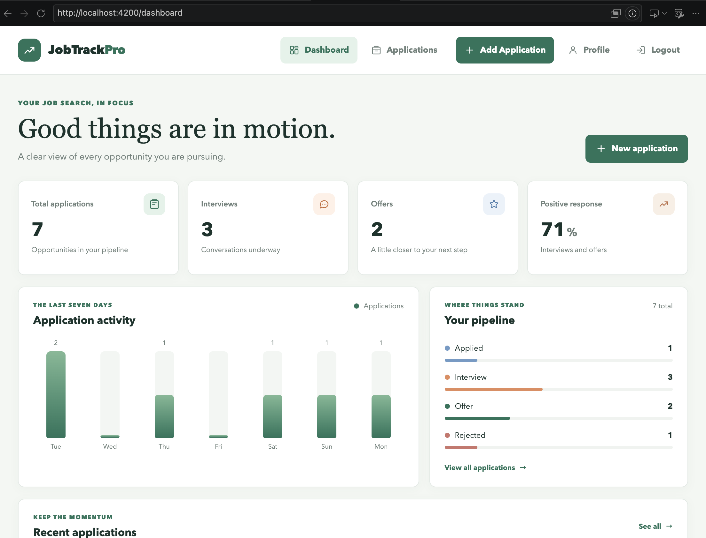
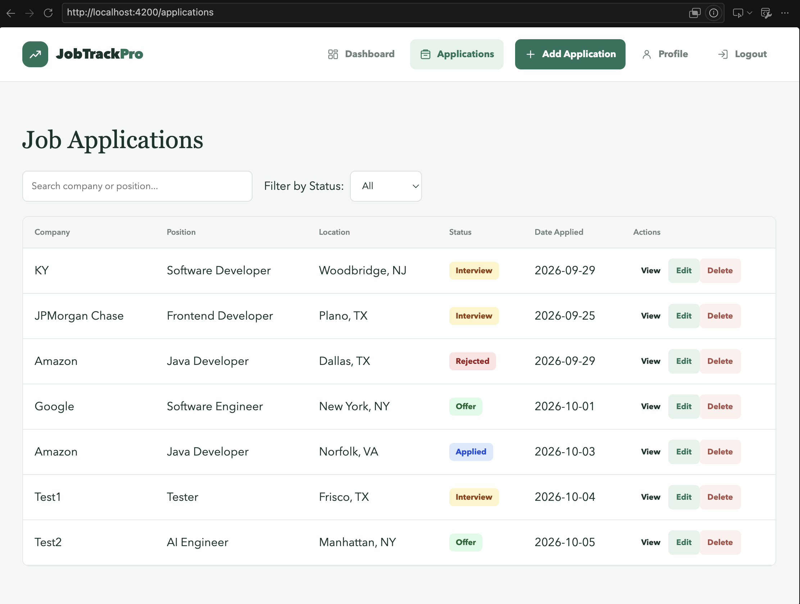
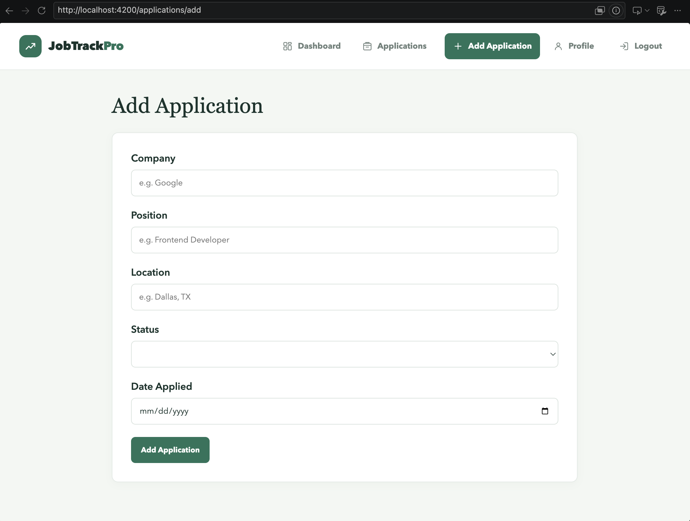
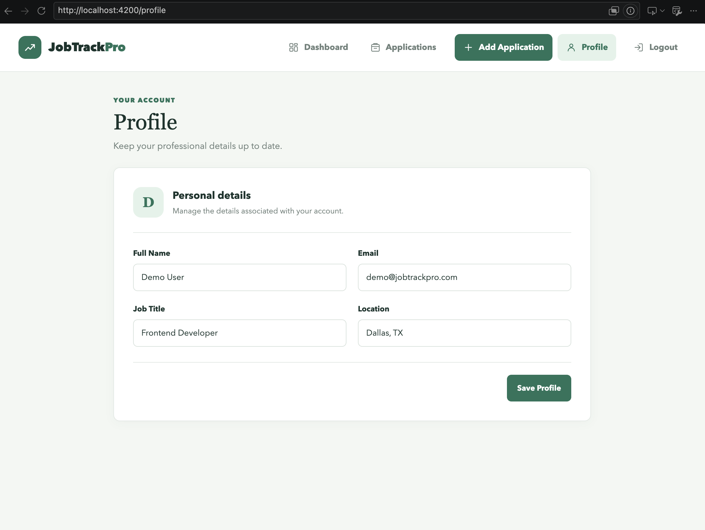

# JobTrack Pro


JobTrack Pro is an Angular job application tracking dashboard for managing and monitoring a job search pipeline. Track opportunities from application through interview, offer, or rejection, and keep application details and profile information organized in one place.

## Features

- Dashboard totals for applications, interviews, and offers, plus a positive response rate
- Seven-day application activity chart, status pipeline overview, and recent applications
- Create, view, edit, and delete job applications
- Search applications by company or position and filter by status
- Status badges for Applied, Interview, Offer, and Rejected
- Reactive application form with required-field validation
- Client-side demo login/logout with functional route guards
- Editable profile with localStorage persistence
- Loading and error states for application data
- Responsive layouts for dashboard, forms, navigation, and application list

## Tech Stack

- Angular 22 and TypeScript
- HTML and SCSS
- Angular Router and standalone components
- Angular Reactive Forms and template-driven forms
- Angular Signals and `computed` state
- Angular `HttpClient` and REST API requests
- JSON Server with `db.json` for local application data
- Browser `localStorage` for demo login state and profile data
- Git and GitHub for version control and portfolio hosting

## Architecture

The application uses standalone Angular components organized by responsibility:

- `core/models` defines the application data model.
- `core/services` owns application state and JSON Server requests.
- `core/guards` contains functional route guards for authenticated and guest-only routes.
- `features` contains the dashboard, application workflows, login, and profile pages.
- `shared` contains reusable application UI such as the navbar.

Application data follows this request path:

```text
Angular UI -> Components -> Application Service -> HttpClient
           -> JSON Server REST API -> db.json
```

The application service exposes the application collection as an Angular signal and derives dashboard counts with `computed` state.

## Routes

| Route               | Purpose                                                       | Access                                          |
| ------------------- | ------------------------------------------------------------- | ----------------------------------------------- |
| `/login`            | Demo sign-in                                                  | Guest only; signed-in users go to the dashboard |
| `/dashboard`        | Analytics and application pipeline                            | Protected                                       |
| `/applications`     | Searchable, filterable application list                       | Protected                                       |
| `/applications/add` | Create an application                                         | Protected                                       |
| `/applications/:id` | Application detail route                                      | Protected                                       |
| `/profile`          | Edit profile details                                          | Protected                                       |
| `/`                 | Redirects to the dashboard or login based on demo login state | Redirect                                        |

Unknown routes redirect through `/` and follow the same login-state behavior.

## Getting Started

### Prerequisites

- Node.js and npm
- A terminal

Angular CLI and JSON Server are included as development dependencies; a global Angular CLI installation is not required.

### Install dependencies

```sh
npm install
```

### Start JSON Server

In one terminal, start the local REST API on port `3000`:

```sh
npx json-server db.json --port 3000
```

The application service requests application records from `http://localhost:3000/applications`.

### Start Angular

In another terminal, run the development server:

```sh
npm start
```

Open the local URL printed by Angular in the terminal. The default Angular development server URL is typically `http://localhost:4200/`; Angular may select a different port if that port is already in use.

## Demo Authentication

This project uses client-side demo authentication for portfolio purposes. Any non-empty email and password can be used to sign in. The login state is stored in `localStorage` under `isLoggedIn`, and route guards protect the application pages. Profile fields are saved separately under `jobTrackProfile`.

This is not production authentication. Credentials are not verified by a backend, and this demo should not be used to protect real accounts or sensitive data.

## Project Structure

```text
.
├── db.json
├── package.json
├── README.md
└── src/
    ├── app/
    │   ├── core/
    │   │   ├── guards/
    │   │   ├── models/
    │   │   └── services/
    │   ├── features/
    │   │   ├── applications/
    │   │   │   ├── application-detail/
    │   │   │   ├── application-form/
    │   │   │   └── application-list/
    │   │   ├── auth/login/
    │   │   ├── dashboard/
    │   │   └── profile/
    │   ├── shared/navbar/
    │   ├── app.config.ts
    │   └── app.routes.ts
    ├── index.html
    └── styles.scss
```

## Testing and Build

Run the unit tests with the configured Angular test runner:

```sh
npm test
```

To run tests once without watch mode:

```sh
npm test -- --watch=false
```

Create a production build:

```sh
npm run build
```

The production output is written to `dist/`. No end-to-end test script is currently defined in `package.json`.

## Screenshots

Screenshot files are not included yet. Add them to `docs/screenshots/` using these filenames for the images to display here.

### Login



### Dashboard



### Applications



### Add Application



### Profile



## Future Improvements

These are possible future additions and are not current features:

- Backend-backed authentication and authorization
- Persistent database integration beyond the local JSON Server
- A cloud-hosted REST API
- Pagination for larger application lists
- Additional job-search and pipeline analytics

## Portfolio Summary

JobTrack Pro demonstrates Angular component architecture, REST API integration, CRUD workflows, reactive forms and validation, routing and functional route guards, state management with Angular Signals, and responsive UI development.
